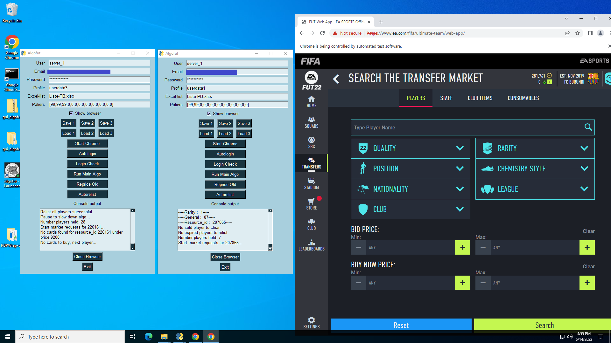

# Algofut
FIFA Ultimate Team - Algorithmic Trading

### The purpose of this repo is to showcase FIFA trading tools developed in Python and tested live on FUT 22.

The following is the data infrastructure used to run the strategies:
  Data for players is gathered 24/7 from FutBin.com using a scraper that runs on an E2 instance on GCP.
  Player data (or assets) is relatively static so it is stored in a MySQL database hosted on GCP.
  Price data is stored on an InfluxDB database as it is easier to manage and query timeseries using InfluxDB.

The above mentionned data is then fed into the trading algorithm which connects to FUT22's server.
  Selenium-wire is used to open a Chrome browser instance and authenticate the account.
  Selenium-wire then forwards authentication credentials to python's requests package which then retrieves market data, and sends buy/sell order through the game's REST    API. Selenium-wire keeps the Chrome browser instance open in the background to manage and maintain the connection with the server.
  Telegram is also used to get notified remotely whenever the code starts, stops, or user action is required (filling captcha etc.).
  

The following image shows the Algofut tool with a GUI compiled into a standalone application running on a Windows Server VM.

The intention is to release the data gathered throughout the 2022 by the end of the game (September 2022) as high frequency price data is scarce for FUT. 
